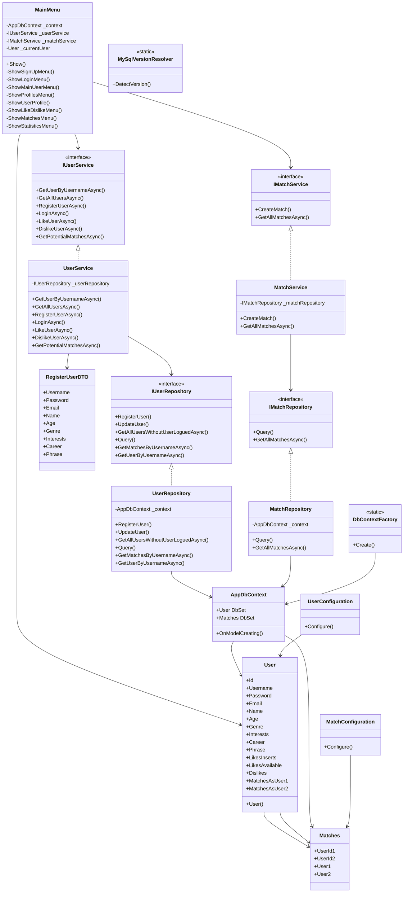

# Diagrama de Clases - CampusLove

## Vista General de la Arquitectura

## Detalle de Relaciones

### Relaciones de Herencia
- `UserService` implementa `IUserService`
- `UserRepository` implementa `IUserRepository`
- `MatchService` implementa `IMatchService`
- `MatchRepository` implementa `IMatchRepository`

### Relaciones de Composición
- `MainMenu` contiene `UserService` y `MatchService`
- `UserService` contiene `UserRepository`
- `MatchService` contiene `MatchRepository`
- `AppDbContext` contiene `DbSet<User>` y `DbSet<Matches>`

### Relaciones de Asociación
- `User` tiene muchos `Matches` (como User1)
- `User` tiene muchos `Matches` (como User2)
- `Matches` tiene dos `User` (User1 y User2)

## Patrones de Diseño Aplicados

### 1. Repository Pattern
- `IUserRepository` y `UserRepository`
- `IMatchRepository` y `MatchRepository`
- Abstracción del acceso a datos

### 2. Service Pattern
- `IUserService` y `UserService`
- `IMatchService` y `MatchService`
- Lógica de negocio centralizada

### 3. Factory Pattern
- `DbContextFactory`
- Creación de instancias de `AppDbContext`

### 4. Strategy Pattern
- Diferentes estrategias de emparejamiento en `UserService.GetPotentialMatchesAsync()`

### 5. DTO Pattern
- `RegisterUserDTO` para transferencia de datos de registro

## Responsabilidades por Capa

### Capa de Presentación
- **MainMenu**: Interfaz de usuario y navegación

### Capa de Aplicación
- **UserService**: Lógica de negocio de usuarios
- **MatchService**: Lógica de negocio de matches
- **DTOs**: Transferencia de datos

### Capa de Dominio
- **User**: Entidad principal del usuario
- **Matches**: Entidad de coincidencias

### Capa de Infraestructura
- **UserRepository**: Acceso a datos de usuarios
- **MatchRepository**: Acceso a datos de matches
- **AppDbContext**: Contexto de Entity Framework
- **Configurations**: Mapeo de entidades

### Capa Compartida
- **DbContextFactory**: Factory para contextos
- **MySqlVersionResolver**: Utilidades de base de datos
